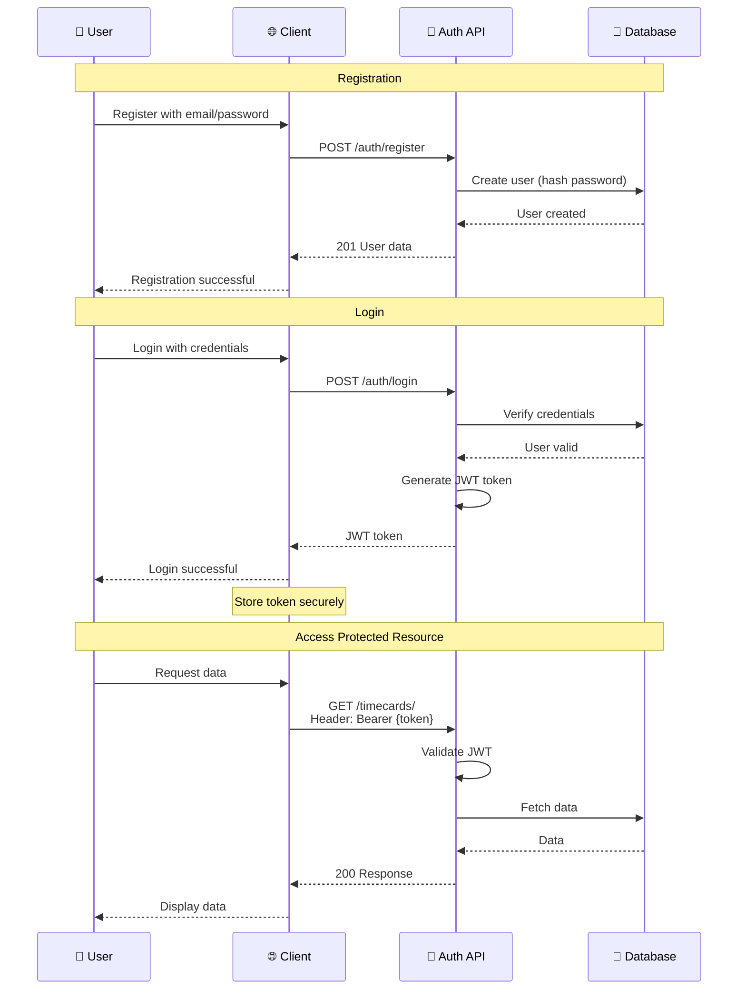
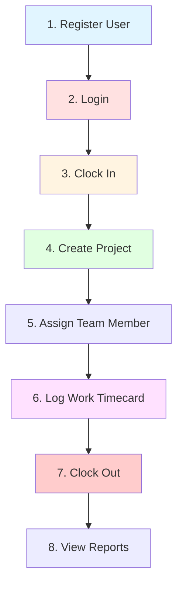

# 📚 Timecard Management API - Complete Documentation

**Version:** 1.0  
**Base URL:** `http://localhost:8000/api/v1`  
**Authentication:** JWT Bearer Token

---

## 📑 Table of Contents

1. [Overview](#overview)
2. [Authentication Flow](#authentication-flow)
3. [API Endpoints](#api-endpoints)
4. [Request/Response Examples](#requestresponse-examples)
5. [Error Handling](#error-handling)
6. [Rate Limiting & Best Practices](#best-practices)

---

## 🎯 Overview

The Timecard Management API provides a complete solution for employee time tracking, including:

- **👤 User Authentication** - Secure JWT-based auth
- **⏰ Attendance Tracking** - Clock in/out with exact timestamps
- **📋 Work Logs** - Daily timecards with project time allocation
- **📁 Project Management** - Create and manage projects
- **👥 Team Assignments** - Assign employees to projects with roles

### System Architecture

```mermaid
graph LR
    Client[🌐 Client App] --> Auth[\ud83d\udd10 Auth API]
    Auth --> Token[JWT Token]
    Token --> Protected[🔒 Protected Endpoints]
    
    Protected --> Punch[\u23f0 Punch API<br/>Clock In/Out]
    Protected --> Timecard[\ud83d\udccb Timecard API<br/>Work Logs]
    Protected --> Project[\ud83d\udcc1 Project API<br/>Management]
    Protected --> Assign[\ud83d\udc65 Assignment API<br/>Team Roles]
    
    Punch --> DB[(\ud83d\udcbe Database)]
    Timecard --> DB
    Project --> DB
    Assign --> DB
    
    style Client fill:#e1f5ff
    style Token fill:#ffe1e1
    style DB fill:#e1ffe1
```

---

## 🔐 Authentication Flow

### How Authentication Works



### Token Lifetime
- **Access Token:** 24 hours (1440 minutes)
- **Refresh:** Re-login after expiration
- **Storage:** Store securely (HttpOnly cookies recommended)

---

## 📊 API Endpoints

### 🔐 Authentication Endpoints

#### Register New User
```http
POST /api/v1/auth/register
Content-Type: application/json

{
  "email": "user@company.com",
  "password": "securepassword123",
  "full_name": "John Doe"
}
```

**Response:** `201 Created`
```json
{
  "id": 1,
  "email": "user@company.com",
  "full_name": "John Doe",
  "is_active": true,
  "is_superuser": false,
  "created_at": "2026-04-02T10:30:00Z"
}
```

#### Login
```http
POST /api/v1/auth/login
Content-Type: application/json

{
  "email": "user@company.com",
  "password": "securepassword123"
}
```

**Response:** `200 OK`
```json
{
  "access_token": "eyJhbGciOiJIUzI1NiIsInR5cCI6IkpXVCJ9...",
  "token_type": "bearer"
}
```

#### Get Current User Profile
```http
GET /api/v1/auth/me
Authorization: Bearer {your_token}
```

**Response:** `200 OK`
```json
{
  "id": 1,
  "email": "user@company.com",
  "full_name": "John Doe",
  "is_active": true,
  "is_superuser": false,
  "created_at": "2026-04-02T10:30:00Z"
}
```

---

### ⏰ Attendance (Punch) Endpoints

#### Clock In
```http
POST /api/v1/punch/in
Authorization: Bearer {your_token}
Content-Type: application/json

{
  "notes": "Starting morning shift"
}
```

**Response:** `201 Created`
```json
{
  "id": 1,
  "user_id": 1,
  "date": "2026-04-02",
  "punch_in": "2026-04-02T09:00:00Z",
  "punch_out": null,
  "notes": "Starting morning shift",
  "created_at": "2026-04-02T09:00:00Z"
}
```

#### Clock Out
```http
POST /api/v1/punch/out
Authorization: Bearer {your_token}
Content-Type: application/json

{
  "notes": "End of day"
}
```

**Response:** `200 OK`
```json
{
  "id": 1,
  "user_id": 1,
  "date": "2026-04-02",
  "punch_in": "2026-04-02T09:00:00Z",
  "punch_out": "2026-04-02T17:30:00Z",
  "notes": "End of day",
  "created_at": "2026-04-02T09:00:00Z",
  "updated_at": "2026-04-02T17:30:00Z"
}
```

#### Get Active Punch
```http
GET /api/v1/punch/active
Authorization: Bearer {your_token}
```

**Returns:** Currently active punch entry (not clocked out yet) or `null`

#### Get Punch History
```http
GET /api/v1/punch/?start_date=2026-04-01&end_date=2026-04-07
Authorization: Bearer {your_token}
```

**Query Parameters:**
- `start_date` (optional): Filter from this date
- `end_date` (optional): Filter until this date

**Response:** Array of punch entries

#### Get Daily Hours
```http
GET /api/v1/punch/hours/2026-04-02
Authorization: Bearer {your_token}
```

**Response:**
```json
{
  "date": "2026-04-02",
  "total_hours": 8.5
}
```

---

### 📋 Timecard (Work Log) Endpoints

#### Create Timecard
```http
POST /api/v1/timecards/
Authorization: Bearer {your_token}
Content-Type: application/json

{
  "date": "2026-04-02T09:00:00Z",
  "hours_worked": 8.0,
  "description": "Worked on backend API development and bug fixes",
  "project": "Timecard Management System"
}
```

**Response:** `201 Created`
```json
{
  "id": 1,
  "user_id": 1,
  "date": "2026-04-02T09:00:00Z",
  "hours_worked": 8.0,
  "description": "Worked on backend API development and bug fixes",
  "project": "Timecard Management System",
  "created_at": "2026-04-02T18:00:00Z"
}
```

#### Get My Timecards
```http
GET /api/v1/timecards/
Authorization: Bearer {your_token}
```

**Response:** Array of all your timecards

#### Get Specific Timecard
```http
GET /api/v1/timecards/42
Authorization: Bearer {your_token}
```

#### Update Timecard
```http
PUT /api/v1/timecards/42
Authorization: Bearer {your_token}
Content-Type: application/json

{
  "hours_worked": 9.0,
  "description": "Updated description with additional tasks"
}
```

#### Delete Timecard
```http
DELETE /api/v1/timecards/42
Authorization: Bearer {your_token}
```

**Response:** `204 No Content`

---

### 📁 Project Endpoints

#### Create Project
```http
POST /api/v1/projects/
Authorization: Bearer {your_token}
Content-Type: application/json

{
  "name": "Mobile App Redesign",
  "code": "MOBILE2024",
  "description": "Complete UI/UX redesign of mobile application",
  "department": "Engineering",
  "company": "Tech Corp",
  "supervisor_id": 1,
  "status": "active",
  "start_date": "2026-04-01"
}
```

**Response:** `201 Created` with project details

#### Get Projects (Flexible Filtering)
```http
GET /api/v1/projects/
Authorization: Bearer {your_token}
```

**Query Parameters:**
- `status`: Filter by status (`active`, `completed`, `on_hold`, `cancelled`)
- `department`: Filter by department name
- `code`: Get specific project by unique code
- `created_by_me`: Show only projects I created (`true`/`false`)
- `supervised_by_me`: Show only projects I supervise (`true`/`false`)
- `search`: Search by name, code, or description (min 2 chars)
- `skip`: Pagination offset (default: 0)
- `limit`: Max results (default: 100, max: 500)

**Examples:**
```http
# All active projects
GET /projects/?status=active

# Projects I created
GET /projects/?created_by_me=true

# Search for projects
GET /projects/?search=mobile

# Specific project by code
GET /projects/?code=TMS

# My active supervised projects
GET /projects/?supervised_by_me=true&status=active

# Paginated results
GET /projects/?skip=20&limit=10
```

#### Get Project by ID
```http
GET /api/v1/projects/42
Authorization: Bearer {your_token}
```

#### Update Project
```http
PUT /api/v1/projects/42
Authorization: Bearer {your_token}
Content-Type: application/json

{
  "description": "Updated project description",
  "status": "completed"
}
```

**Note:** Only project creator or supervisor can update

#### Update Project Status Only
```http
PATCH /api/v1/projects/42/status
Authorization: Bearer {your_token}
Content-Type: application/json

{
  "status": "completed"
}
```

#### Delete Project
```http
DELETE /api/v1/projects/42
Authorization: Bearer {your_token}
```

**Note:** Only project creator can delete

---

### 👥 Assignment Endpoints

#### Create Assignment
```http
POST /api/v1/assignments/
Authorization: Bearer {your_token}
Content-Type: application/json

{
  "project_id": 1,
  "user_id": 5,
  "role": "Senior Developer",
  "notes": "Lead backend development"
}
```

**Response:** `201 Created`
```json
{
  "id": 1,
  "project_id": 1,
  "user_id": 5,
  "assigner_id": 1,
  "role": "Senior Developer",
  "status": "pending",
  "notes": "Lead backend development",
  "created_at": "2026-04-02T10:00:00Z"
}
```

#### Get Assignments (Flexible Filtering)
```http
GET /api/v1/assignments/
Authorization: Bearer {your_token}
```

**Query Parameters:**
- `project_id`: Filter by project
- `user_id`: Filter by assigned user
- `status`: Filter by status (`pending`, `approved`, `rejected`, `revoked`)
- `my_assignments`: Show only my assignments (`true`)

**Examples:**
```http
# My assignments
GET /assignments/?my_assignments=true

# All assignments for a project
GET /assignments/?project_id=1

# Pending assignments
GET /assignments/?status=pending

# User's approved assignments
GET /assignments/?user_id=5&status=approved
```

#### Approve/Reject Assignment
```http
PATCH /api/v1/assignments/42/approve
Authorization: Bearer {your_token}
```

```http
PATCH /api/v1/assignments/42/reject
Authorization: Bearer {your_token}
```

#### Update Assignment
```http
PUT /api/v1/assignments/42
Authorization: Bearer {your_token}
Content-Type: application/json

{
  "role": "Lead Developer",
  "notes": "Updated role and responsibilities"
}
```

#### Delete Assignment
```http
DELETE /api/v1/assignments/42
Authorization: Bearer {your_token}
```

---

## 🔄 Request/Response Examples

### Complete Workflow Example



### 1. New User Onboarding

```bash
# Step 1: Register
curl -X POST http://localhost:8000/api/v1/auth/register \
  -H "Content-Type: application/json" \
  -d '{
    "email": "alice@company.com",
    "password": "secure123",
    "full_name": "Alice Johnson"
  }'

# Step 2: Login and get token
TOKEN=$(curl -s -X POST http://localhost:8000/api/v1/auth/login \
  -H "Content-Type: application/json" \
  -d '{
    "email": "alice@company.com",
    "password": "secure123"
  }' | jq -r '.access_token')

echo "Token: $TOKEN"
```

### 2. Daily Work Flow

```bash
# Morning: Clock in
curl -X POST http://localhost:8000/api/v1/punch/in \
  -H "Authorization: Bearer $TOKEN" \
  -H "Content-Type: application/json" \
  -d '{"notes": "Starting work"}'

# During Day: Log work on timecard
curl -X POST http://localhost:8000/api/v1/timecards/ \
  -H "Authorization: Bearer $TOKEN" \
  -H "Content-Type: application/json" \
  -d '{
    "date": "2026-04-02T09:00:00Z",
    "hours_worked": 8.0,
    "description": "API development and testing",
    "project": "Backend Redesign"
  }'

# Evening: Clock out
curl -X POST http://localhost:8000/api/v1/punch/out \
  -H "Authorization: Bearer $TOKEN" \
  -H "Content-Type: application/json" \
  -d '{"notes": "End of day"}'
```

### 3. Project Management

```bash
# Create new project
curl -X POST http://localhost:8000/api/v1/projects/ \
  -H "Authorization: Bearer $TOKEN" \
  -H "Content-Type: application/json" \
  -d '{
    "name": "Customer Portal v2",
    "code": "PORTAL2",
    "description": "Next generation customer portal",
    "supervisor_id": 1,
    "status": "active"
  }'

# Assign team member
curl -X POST http://localhost:8000/api/v1/assignments/ \
  -H "Authorization: Bearer $TOKEN" \
  -H "Content-Type: application/json" \
  -d '{
    "project_id": 1,
    "user_id": 5,
    "role": "Frontend Developer"
  }'

# Approve assignment
curl -X PATCH http://localhost:8000/api/v1/assignments/1/approve \
  -H "Authorization: Bearer $TOKEN"
```

---

## ⚠️ Error Handling

### Standard Error Response Format

```json
{
  "detail": "Error description here"
}
```

### HTTP Status Codes

| Code | Meaning | Description |
|------|---------|-------------|
| 200 | OK | Request successful |
| 201 | Created | Resource created successfully |
| 204 | No Content | Successful deletion |
| 400 | Bad Request | Invalid request data |
| 401 | Unauthorized | Missing or invalid token |
| 403 | Forbidden | Insufficient permissions |
| 404 | Not Found | Resource doesn't exist |
| 409 | Conflict | Resource conflict (e.g., duplicate) |
| 422 | Unprocessable Entity | Validation error |
| 500 | Server Error | Internal server error |

### Common Error Examples

#### 401 Unauthorized
```json
{
  "detail": "Could not validate credentials"
}
```

**Solution:** Include valid JWT token in Authorization header

#### 409 Conflict
```json
{
  "detail": "Timecard already exists for 2026-04-02"
}
```

**Solution:** Update existing timecard instead of creating new one

#### 422 Validation Error
```json
{
  "detail": [
    {
      "loc": ["body", "hours_worked"],
      "msg": "ensure this value is less than or equal to 24",
      "type": "value_error.number.not_le"
    }
  ]
}
```

**Solution:** Fix validation errors in request body

---

## ✅ Best Practices

### 1. Token Management

```javascript
// ✅ Good: Store token securely
localStorage.setItem('access_token', token);

// ✅ Better: Use HttpOnly cookies (if backend supports)
// Automatically handled by browser

// ❌ Bad: Don't expose in URL
// https://api.com/data?token=abc123
```

### 2. Error Handling

```javascript
// ✅ Good: Handle all error cases
try {
  const response = await fetch('/api/v1/timecards/', {
    headers: {
      'Authorization': `Bearer ${token}`,
      'Content-Type': 'application/json'
    },
    method: 'POST',
    body: JSON.stringify(data)
  });
  
  if (!response.ok) {
    const error = await response.json();
    throw new Error(error.detail);
  }
  
  return await response.json();
} catch (error) {
  console.error('Failed to create timecard:', error.message);
  // Show user-friendly error message
}
```

### 3. Pagination

```javascript
// ✅ Good: Use pagination for large datasets
async function getAllProjects() {
  const limit = 100;
  let skip = 0;
  let allProjects = [];
  
  while (true) {
    const projects = await fetch(
      `/api/v1/projects/?skip=${skip}&limit=${limit}`,
      { headers: { 'Authorization': `Bearer ${token}` }}
    ).then(r => r.json());
    
    allProjects.push(...projects);
    
    if (projects.length < limit) break;
    skip += limit;
  }
  
  return allProjects;
}
```

### 4. Query Parameters

```javascript
// ✅ Good: Build query params properly
const params = new URLSearchParams({
  status: 'active',
  created_by_me: 'true',
  department: 'Engineering'
});

fetch(`/api/v1/projects/?${params}`, {
  headers: { 'Authorization': `Bearer ${token}` }
});
```

### 5. Batch Operations

```javascript
// ✅ Good: Avoid N+1 queries - fetch related data together
// Get projects with assignments in one go
const projects = await fetch('/api/v1/projects/')
  .then(r => r.json());

const projectIds = projects.map(p => p.id);
const assignments = await fetch(
  `/api/v1/assignments/?project_id=${projectIds.join(',')}`
).then(r => r.json());
```

---

## 📊 Data Models

### User
```json
{
  "id": 1,
  "email": "user@company.com",
  "full_name": "John Doe",
  "is_active": true,
  "is_superuser": false,
  "created_at": "2026-04-02T10:00:00Z",
  "updated_at": "2026-04-02T10:00:00Z"
}
```

### Punch Entry
```json
{
  "id": 1,
  "user_id": 1,
  "date": "2026-04-02",
  "punch_in": "2026-04-02T09:00:00Z",
  "punch_out": "2026-04-02T17:30:00Z",
  "notes": "Regular shift",
  "created_at": "2026-04-02T09:00:00Z",
  "updated_at": "2026-04-02T17:30:00Z"
}
```

### Timecard
```json
{
  "id": 1,
  "user_id": 1,
  "date": "2026-04-02T09:00:00Z",
  "hours_worked": 8.0,
  "description": "API development",
  "project": "Backend System",
  "created_at": "2026-04-02T18:00:00Z",
  "updated_at": null
}
```

### Project
```json
{
  "id": 1,
  "name": "Mobile App",
  "code": "MOBILE",
  "description": "Mobile application development",
  "department": "Engineering",
  "company": "Tech Corp",
  "creator_id": 1,
  "supervisor_id": 1,
  "status": "active",
  "start_date": "2026-04-01",
  "end_date": null,
  "created_at": "2026-04-01T10:00:00Z",
  "updated_at": null
}
```

### Project Assignment
```json
{
  "id": 1,
  "project_id": 1,
  "user_id": 5,
  "assigner_id": 1,
  "status": "approved",
  "approved_by_id": 1,
  "approved_at": "2026-04-02T11:00:00Z",
  "role": "Senior Developer",
  "notes": "Lead backend development",
  "created_at": "2026-04-02T10:00:00Z",
  "updated_at": "2026-04-02T11:00:00Z"
}
```

---

## 🚀 Quick Start Testing

### Using Swagger UI (Recommended)

1. Start server: `uvicorn src.app.main:app --reload`
2. Visit: http://localhost:8000/api/v1/docs
3. Try `/auth/register` to create account
4. Try `/auth/login` to get token
5. Click **🔓 Authorize** button, paste your token
6. Test all protected endpoints!

### Using cURL

```bash
# Complete workflow in 30 seconds
./scripts/quick-test.sh
```

### Using Python

```python
import requests

BASE_URL = "http://localhost:8000/api/v1"

# 1. Register
response = requests.post(f"{BASE_URL}/auth/register", json={
    "email": "test@example.com",
    "password": "test123",
    "full_name": "Test User"
})
print("Registered:", response.json())

# 2. Login
response = requests.post(f"{BASE_URL}/auth/login", json={
    "email": "test@example.com",
    "password": "test123"
})
token = response.json()["access_token"]
print("Token:", token[:20] + "...")

# 3. Get profile
headers = {"Authorization": f"Bearer {token}"}
response = requests.get(f"{BASE_URL}/auth/me", headers=headers)
print("Profile:", response.json())
```

---

## 📞 Support

- **Documentation:** http://localhost:8000/api/v1/docs
- **ReDoc:** http://localhost:8000/redoc
- **Health Check:** http://localhost:8000/health

---

**Built with ❤️ using FastAPI, Clean Architecture, and Best Practices**
