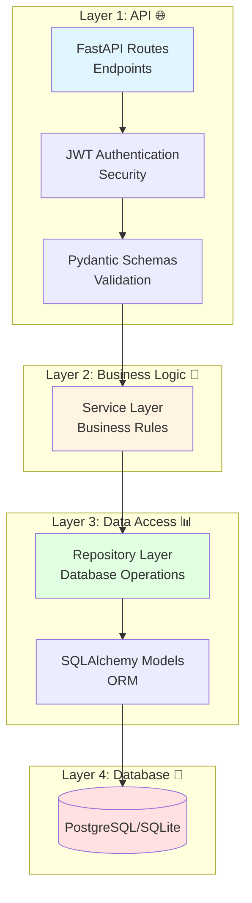
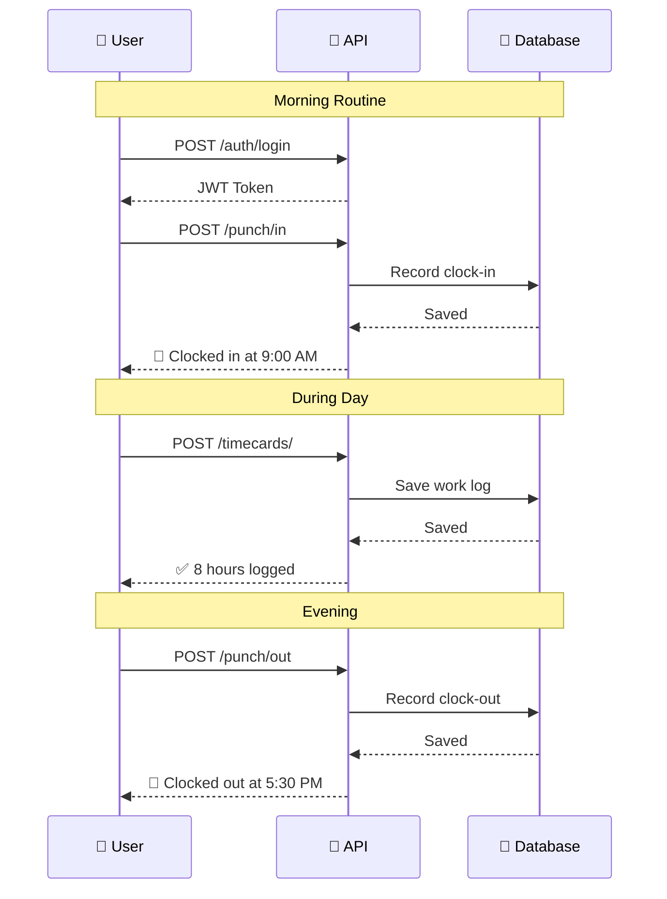

# ⏰ Timecard Management API

> **Production-ready employee time tracking system built with FastAPI and Clean Architecture**

[](https://www.python.org/downloads/)
[](https://fastapi.tiangolo.com)
[](https://opensource.org/licenses/MIT)

---

## 🌟 Features

- ✅ **JWT Authentication** - Secure token-based authentication  
- ✅ **Clock In/Out** - Precise attendance tracking with timestamps  
- ✅ **Work Logs** - Daily timecards with project time allocation  
- ✅ **Project Management** - Create, track, and manage projects  
- ✅ **Team Assignments** - Assign employees to projects with roles  
- ✅ **Clean Architecture** - Maintainable, testable, scalable codebase  
- ✅ **Automatic API Docs** - Interactive Swagger UI and ReDoc  
- ✅ **Type Safety** - Full type hints with Pydantic validation  
- ✅ **Database Migrations** - Version-controlled schema with Alembic  
- ✅ **Comprehensive Tests** - Unit and integration tests with pytest  

---

## 🏗️ Architecture

Built following **Clean Architecture** principles with clear separation of concerns:



### Key Benefits

- **🎯 Single Responsibility** - Each layer has one clear purpose  
- **🔄 Dependency Inversion** - Inner layers don't depend on outer layers  
- **🧪 Testable** - Easy to test each layer independently  
- **📈 Scalable** - Add features without touching existing code  
- **🛠️ Maintainable** - Clear structure, easy to understand  

---

## 📦 Project Structure

```
timecard_backend/
│
├── src/app/                      # Application source code
│   ├── main.py                  # FastAPI application entry
│   │
│   ├── api/                     # 🌐 API Layer (Presentation)
│   │   ├── deps.py             # Dependency injection (auth, db)
│   │   └── v1/
│   │       ├── router.py       # API version router
│   │       └── endpoints/      # HTTP endpoint handlers
│   │           ├── auth.py              # 🔐 Authentication
│   │           ├── punch_entries.py     # ⏰ Clock in/out
│   │           ├── timecards.py         # 📋 Work logs
│   │           ├── projects.py          # 📁 Project management
│   │           └── project_assignments.py # 👥 Team assignments
│   │
│   ├── services/                # 💼 Business Logic Layer
│   │   ├── auth_service.py
│   │   ├── punch_entry_service.py
│   │   ├── timecard_service.py
│   │   ├── project_service.py
│   │   └── project_assignment_service.py
│   │
│   ├── repositories/            # 📊 Data Access Layer
│   │   ├── user_repository.py
│   │   ├── punch_entry_repository.py
│   │   ├── timecard_repository.py
│   │   ├── project_repository.py
│   │   └── project_assignment_repository.py
│   │
│   ├── models/                  # 💾 Database Models (ORM)
│   │   ├── user.py
│   │   ├── punch_entry.py
│   │   ├── timecard.py
│   │   ├── project.py
│   │   └── project_assignment.py
│   │
│   ├── schemas/                 # ✅ Pydantic Schemas (DTOs)
│   │   ├── auth.py
│   │   ├── user.py
│   │   ├── punch_entry.py
│   │   ├── timecard.py
│   │   ├── project.py
│   │   └── project_assignment.py
│   │
│   ├── core/                    # ⚙️ Core Configuration
│   │   ├── config.py           # App settings
│   │   └── security.py         # JWT, password hashing
│   │
│   └── db/                      # 🗄️ Database Setup
│       ├── base.py             # Declarative base
│       ├── session.py          # Session factory
│       └── init_db.py          # Database initialization
│
├── tests/                       # 🧪 Test Suite
│   ├── conftest.py             # Test fixtures
│   ├── test_auth.py
│   ├── test_punch_entries.py
│   ├── test_timecards.py
│   ├── test_projects.py
│   └── test_project_assignments.py
│
├── alembic/                     # 📝 Database Migrations
│   ├── env.py
│   └── versions/
│
├── scripts/                     # 🛠️ Utility Scripts
│   ├── seed_data.py            # Populate test data
│   └── init_db.py              # Initialize database
│
├── docs/                        # 📚 Documentation
│   ├── API_TESTING_GUIDE.md
│   └── SWAGGER_AUTH_GUIDE.md
│
├── API_DOCUMENTATION.md         # 📖 Complete API docs
├── TEAM_CREDENTIALS.md          # 🔑 Test credentials
├── README.md                    # This file
├── requirements.txt             # Python dependencies
├── pytest.ini                   # Test configuration
└── alembic.ini                  # Migration configuration
```

---

## 🚀 Quick Start

### Prerequisites

- **Python 3.9+** installed
- **Virtual environment** (recommended)
- **PostgreSQL** (or SQLite for development)

### Installation

```bash
# 1️⃣ Clone the repository
git clone <repository-url>
cd timecard_backend_full

# 2️⃣ Create and activate virtual environment
python -m venv venv
source venv/bin/activate  # On Windows: venv\Scripts\activate

# 3️⃣ Install dependencies
pip install -r requirements.txt

# 4️⃣ Set up environment variables
cp .env.example .env
# Edit .env with your settings

# 5️⃣ Run database migrations
alembic upgrade head

# 6️⃣ (Optional) Seed test data
PYTHONPATH=. python scripts/seed_data.py

# 7️⃣ Start the development server
uvicorn src.app.main:app --reload
```

### 🎉 You're Ready!

- **API Documentation:** http://localhost:8000/api/v1/docs
- **Alternative Docs:** http://localhost:8000/redoc
- **Health Check:** http://localhost:8000/health

---

## 📖 API Overview

### Quick Examples



### Core Endpoints

#### Authentication 🔐
```bash
POST   /api/v1/auth/register     # Create account
POST   /api/v1/auth/login        # Get JWT token
GET    /api/v1/auth/me           # Get profile
```

#### Attendance ⏰
```bash
POST   /api/v1/punch/in          # Clock in
POST   /api/v1/punch/out         # Clock out
GET    /api/v1/punch/active      # Current status
GET    /api/v1/punch/            # Punch history
```

#### Work Logs 📋
```bash
POST   /api/v1/timecards/        # Create timecard
GET    /api/v1/timecards/        # List timecards
GET    /api/v1/timecards/{id}    # Get specific
PUT    /api/v1/timecards/{id}    # Update
DELETE /api/v1/timecards/{id}    # Delete
```

#### Projects 📁
```bash
POST   /api/v1/projects/         # Create project
GET    /api/v1/projects/         # List (flexible filters)
GET    /api/v1/projects/{id}     # Get specific
PUT    /api/v1/projects/{id}     # Update
DELETE /api/v1/projects/{id}     # Delete
```

#### Assignments 👥
```bash
POST   /api/v1/assignments/      # Assign user
GET    /api/v1/assignments/      # List assignments
PATCH  /api/v1/assignments/{id}/approve  # Approve
PUT    /api/v1/assignments/{id}  # Update
DELETE /api/v1/assignments/{id}  # Remove
```

---

## 🧪 Testing

### Run Tests

```bash
# Run all tests
pytest

# Run with coverage
pytest --cov=src/app tests/

# Run specific test file
pytest tests/test_auth.py

# Run with verbose output
pytest -v

# Run and show print statements
pytest -s
```

### Test Coverage

```bash
# Generate HTML coverage report
pytest --cov=src/app --cov-report=html tests/
open htmlcov/index.html  # View in browser
```

---

## 🔧 Development

### Code Quality

```bash
# Format code with black
black src/ tests/

# Sort imports
isort src/ tests/

# Type checking with mypy
mypy src/

# Lint with flake8
flake8 src/ tests/
```

### Database Migrations

```bash
# Create new migration
alembic revision --autogenerate -m "Add new table"

# Apply migrations
alembic upgrade head

# Rollback one version
alembic downgrade -1

# View migration history
alembic history
```

### Seed Test Data

```bash
# Populate database with sample team data
PYTHONPATH=. python scripts/seed_data.py
```

**🔑 Test Credentials:** See [TEAM_CREDENTIALS.md](TEAM_CREDENTIALS.md)

The database is seeded with:
- **1 Manager:** Sunil (sunil@company.com / sunil123)
- **5 Employees:** Sandeep, Nithikesh, Sumeeth, Jatin, Aditya
- **5 Active Projects:** TMS, MOBILE, DBOPT, SEC, PORTAL
- **10 Project Assignments** across the team
- **Sample Timecards & Punch Entries** for testing

All credentials with passwords are documented in [TEAM_CREDENTIALS.md](TEAM_CREDENTIALS.md)

---

## 📚 Documentation

| Document | Description |
|----------|-------------|
| [API_DOCUMENTATION.md](API_DOCUMENTATION.md) | Complete API reference with examples |
| [TEAM_CREDENTIALS.md](TEAM_CREDENTIALS.md) | **All test user emails & passwords** 🔑 |
| [docs/API_TESTING_GUIDE.md](docs/API_TESTING_GUIDE.md) | How to test endpoints |
| [docs/SWAGGER_AUTH_GUIDE.md](docs/SWAGGER_AUTH_GUIDE.md) | Swagger UI authentication |

---

## 🎯 Use Cases

### 1. Employee Daily Tracking
```python
# Morning: Clock in
POST /punch/in

# During day: Log work
POST /timecards/ {
    "hours_worked": 8.0,
    "project": "Backend API",
    "description": "Implemented authentication"
}

# Evening: Clock out
POST /punch/out
```

### 2. Project Manager
```python
# Create new project
POST /projects/ {
    "name": "Mobile App",
    "code": "MOBILE",
    "supervisor_id": 1
}

# Assign team
POST /assignments/ {
    "project_id": 1,
    "user_id": 5,
    "role": "Lead Developer"
}

# Track progress
GET /timecards/?project=Mobile App
```

### 3. HR Reporting
```python
# Get all punch data for payroll
GET /punch/?start_date=2026-04-01&end_date=2026-04-30

# Get daily hours for specific employee
GET /punch/hours/2026-04-15

# View project allocations
GET /assignments/?status=approved
```

---

## 🛡️ Security Features

- **🔐 Password Hashing** - Bcrypt with automatic salt
- **🎫 JWT Tokens** - Secure stateless authentication
- **✅ Input Validation** - Pydantic schemas validate all input
- **🛡️ SQL Injection Protection** - SQLAlchemy ORM parameterization
- **⏰ Token Expiration** - 24-hour token lifetime
- **🔒 CORS Protection** - Configurable cross-origin policies

---

## 🌍 Environment Variables

```bash
# Create .env file with these variables
SECRET_KEY=your-secret-key-here-use-secrets-token-urlsafe
DATABASE_URL=sqlite:///./timecard.db  # or postgresql://...
ALGORITHM=HS256
ACCESS_TOKEN_EXPIRE_MINUTES=1440
CORS_ORIGINS=http://localhost:3000,http://localhost:8080
```

**Generate Secret Key:**
```bash
python -c "import secrets; print(secrets.token_urlsafe(50))"
```

---

## 🤝 Contributing

1. Fork the repository
2. Create feature branch (`git checkout -b feature/amazing-feature`)
3. Commit changes (`git commit -m 'Add amazing feature'`)
4. Push to branch (`git push origin feature/amazing-feature`)
5. Open Pull Request

---

## 📝 License

This project is licensed under the MIT License - see the [LICENSE](LICENSE) file for details.

---

## 🙏 Acknowledgments

- **FastAPI** - Modern web framework
- **SQLAlchemy** - Powerful ORM
- **Pydantic** - Data validation
- **Alembic** - Database migrations
- **pytest** - Testing framework

---

## 📞 Support & Contact

- **📖 Full Documentation:** [API_DOCUMENTATION.md](API_DOCUMENTATION.md)
- **🔧 Interactive Docs:** http://localhost:8000/api/v1/docs
- **📚 ReDoc:** http://localhost:8000/redoc
- **❤️ Health Check:** http://localhost:8000/health

---

<div align="center">

**⭐ Star this repo if you find it helpful! ⭐**

Built with ❤️ using **FastAPI**, **Clean Architecture**, and **Best Practices**

</div>
