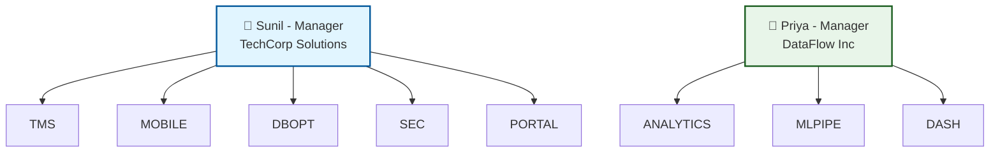
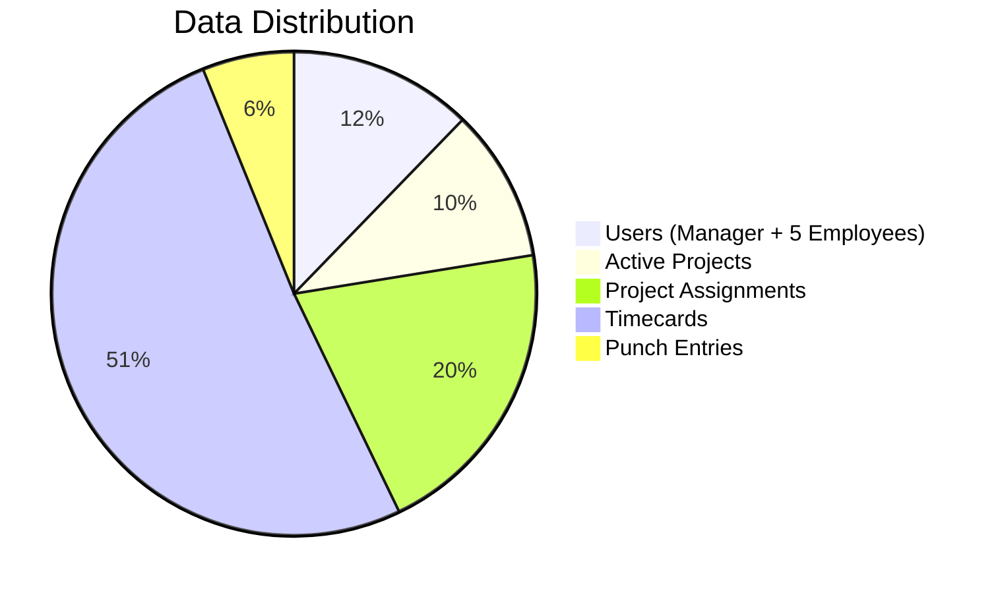

# 🔐 Team Credentials & Test Data

Quick reference for all seeded users, their credentials, and roles in the system.

> **⚠️ IMPORTANT:** These credentials are for **TESTING ONLY**. Never store real passwords in documentation.

---

## 📊 Quick Overview



---

## 🏢 Company 1 — TechCorp Solutions

### 👔 Manager

| Field | Value |
|-------|-------|
| **Name** | Sunil Kumar |
| **Email** | `sunil@techcorp.com` |
| **Password** | `sunil123` |
| **Role** | Manager (`is_superuser = true`) |

**Capabilities:** Create & manage projects · Assign employees · Approve/reject assignments · View all timecards

---

### 👥 Employees

| Name | Email | Password | Projects | Roles |
|------|-------|----------|----------|-------|
| Sai Sandeep Ramavath | `sandeep@techcorp.com` | `sandeep123` | TMS, DBOPT | Lead Developer · Database Engineer |
| Nithikesh Reddy | `nithikesh@techcorp.com` | `nithikesh123` | TMS, MOBILE | Backend Developer · Mobile Developer |
| Sumeeth Goud | `sumeeth@techcorp.com` | `sumeeth123` | MOBILE, PORTAL | Frontend Developer · UI Developer |
| Jatin Sharma | `jatin@techcorp.com` | `jatin123` | SEC, TMS | Security Engineer · DevOps Engineer |
| Aditya Verma | `aditya@techcorp.com` | `aditya123` | PORTAL, DBOPT | Full Stack Developer · Database Developer |

---

### 📁 TechCorp Projects

| Code | Name | Department | Description |
|------|------|-----------|-------------|
| **TMS** | Timecard Management System | Engineering | Full-stack time-tracking platform with REST API and React frontend |
| **MOBILE** | Mobile App Development | Engineering | Cross-platform React Native mobile client for field employees |
| **DBOPT** | Database Optimisation | Infrastructure | Query tuning, indexing strategy, and migration tooling |
| **SEC** | Security Audit | Security | Penetration testing, OWASP review, and hardening recommendations |
| **PORTAL** | Customer Self-Service Portal | Product | Web portal for customers to view invoices and raise support tickets |

---

### 🔗 TechCorp Assignment Matrix

| Employee | Project 1 | Project 2 |
|----------|-----------|-----------|
| Sai Sandeep Ramavath | TMS — Lead Developer | DBOPT — Database Engineer |
| Nithikesh Reddy | TMS — Backend Developer | MOBILE — Mobile Developer |
| Sumeeth Goud | MOBILE — Frontend Developer | PORTAL — UI Developer |
| Jatin Sharma | SEC — Security Engineer | TMS — DevOps Engineer |
| Aditya Verma | PORTAL — Full Stack Developer | DBOPT — Database Developer |

---

## 🏢 Company 2 — DataFlow Inc

### 👔 Manager

| Field | Value |
|-------|-------|
| **Name** | Priya Sharma |
| **Email** | `priya@dataflow.com` |
| **Password** | `priya123` |
| **Role** | Manager (`is_superuser = true`) |

**Capabilities:** Create & manage projects · Assign employees · Approve/reject assignments · View all timecards

---

### 👥 Employees

| Name | Email | Password | Projects | Roles |
|------|-------|----------|----------|-------|
| Rahul Mehta | `rahul@dataflow.com` | `rahul123` | ANALYTICS, MLPIPE | Data Engineer · Pipeline Engineer |
| Neha Joshi | `neha@dataflow.com` | `neha123` | MLPIPE, DASH | ML Engineer · BI Developer |
| Arjun Patel | `arjun@dataflow.com` | `arjun123` | ANALYTICS, DASH | Backend Engineer · Visualisation Developer |
| Kavya Reddy | `kavya@dataflow.com` | `kavya123` | ANALYTICS, MLPIPE | Data Analyst · Data Scientist |

---

### 📁 DataFlow Projects

| Code | Name | Department | Description |
|------|------|-----------|-------------|
| **ANALYTICS** | Analytics Platform | Data Engineering | Real-time event ingestion and aggregation pipeline |
| **MLPIPE** | ML Pipeline | Data Science | Feature engineering, model training, and serving infrastructure |
| **DASH** | Executive Dashboard | Product | Interactive KPI dashboard consumed by C-suite stakeholders |

---

### 🔗 DataFlow Assignment Matrix

| Employee | Project 1 | Project 2 |
|----------|-----------|-----------|
| Rahul Mehta | ANALYTICS — Data Engineer | MLPIPE — Pipeline Engineer |
| Neha Joshi | MLPIPE — ML Engineer | DASH — BI Developer |
| Arjun Patel | ANALYTICS — Backend Engineer | DASH — Visualisation Developer |
| Kavya Reddy | ANALYTICS — Data Analyst | MLPIPE — Data Scientist |

---

## 🧪 Quick Login Commands

```bash
# ── TechCorp Solutions ───────────────────────────────────────────────
# Manager
curl -X POST http://localhost:8000/api/v1/auth/login \
  -H "Content-Type: application/json" \
  -d '{"email": "sunil@techcorp.com", "password": "sunil123"}'

# Employees
curl -X POST http://localhost:8000/api/v1/auth/login -H "Content-Type: application/json" \
  -d '{"email": "sandeep@techcorp.com",   "password": "sandeep123"}'

curl -X POST http://localhost:8000/api/v1/auth/login -H "Content-Type: application/json" \
  -d '{"email": "nithikesh@techcorp.com", "password": "nithikesh123"}'

curl -X POST http://localhost:8000/api/v1/auth/login -H "Content-Type: application/json" \
  -d '{"email": "sumeeth@techcorp.com",   "password": "sumeeth123"}'

curl -X POST http://localhost:8000/api/v1/auth/login -H "Content-Type: application/json" \
  -d '{"email": "jatin@techcorp.com",     "password": "jatin123"}'

curl -X POST http://localhost:8000/api/v1/auth/login -H "Content-Type: application/json" \
  -d '{"email": "aditya@techcorp.com",    "password": "aditya123"}'

# ── DataFlow Inc ─────────────────────────────────────────────────────
# Manager
curl -X POST http://localhost:8000/api/v1/auth/login \
  -H "Content-Type: application/json" \
  -d '{"email": "priya@dataflow.com", "password": "priya123"}'

# Employees
curl -X POST http://localhost:8000/api/v1/auth/login -H "Content-Type: application/json" \
  -d '{"email": "rahul@dataflow.com",  "password": "rahul123"}'

curl -X POST http://localhost:8000/api/v1/auth/login -H "Content-Type: application/json" \
  -d '{"email": "neha@dataflow.com",   "password": "neha123"}'

curl -X POST http://localhost:8000/api/v1/auth/login -H "Content-Type: application/json" \
  -d '{"email": "arjun@dataflow.com",  "password": "arjun123"}'

curl -X POST http://localhost:8000/api/v1/auth/login -H "Content-Type: application/json" \
  -d '{"email": "kavya@dataflow.com",  "password": "kavya123"}'
```

---

## 📊 Database Totals

| Table | Count |
|-------|-------|
| Users | 11 (2 managers + 9 employees) |
| Projects | 8 (5 TechCorp + 3 DataFlow) |
| Assignments | 18 (all approved) |
| Punch Entries | 126 (14 working days per user, today open) |
| Time Allocations | 234 |
| Timecards | 117 |

---

## 📋 Seeded Data Summary



### Database Statistics:
- **👥 Users:** 6 (1 Manager + 5 Employees)
- **📁 Projects:** 5 active projects
- **🔗 Assignments:** 10 project-to-employee assignments
- **📋 Timecards:** 25 time entries across the team
- **⏰ Punch Entries:** 3 clock in/out records

---

## 🚀 Using Credentials in Postman/Insomnia

### Step 1: Login to get JWT token

**Endpoint:** `POST http://localhost:8000/api/v1/auth/login`

**Body (JSON):**
```json
{
  "email": "sandeep@company.com",
  "password": "sandeep123"
}
```

**Response:**
```json
{
  "access_token": "eyJhbGciOiJIUzI1NiIsInR5cCI6IkpXVCJ9...",
  "token_type": "bearer"
}
```

### Step 2: Use token in subsequent requests

**Header:**
```
Authorization: Bearer <your_access_token>
```

### Step 3: Test protected endpoints

**Example - Get my profile:**
```bash
GET http://localhost:8000/api/v1/auth/me
Authorization: Bearer <token>
```

**Example - Get my timecards:**
```bash
GET http://localhost:8000/api/v1/timecards/
Authorization: Bearer <token>
```

---

## 🎯 Testing Scenarios

### Scenario 1: Employee Time Tracking
1. Login as **Sandeep** (`sandeep@company.com` / `sandeep123`)
2. Clock in: `POST /api/v1/punch/in`
3. Create timecard: `POST /api/v1/timecards/`
4. Clock out: `POST /api/v1/punch/out`

### Scenario 2: Manager Overview
1. Login as **Sunil** (`sunil@company.com` / `sunil123`)
2. View all projects: `GET /api/v1/projects/`
3. View project assignments: `GET /api/v1/project-assignments/`
4. View supervised projects: `GET /api/v1/projects/?supervised_by_me=true`

### Scenario 3: Project Collaboration
1. Login as **Nithikesh** (`nithikesh@company.com` / `nithikesh123`)
2. View my projects: `GET /api/v1/projects/?created_by_me=true`
3. Log time to TMS project: `POST /api/v1/timecards/` with project TMS
4. View my timecards: `GET /api/v1/timecards/`

---

## 📱 Interactive API Documentation

Once the server is running:
- **Swagger UI:** http://localhost:8000/api/v1/docs
- **ReDoc:** http://localhost:8000/api/v1/redoc

You can test all endpoints directly from the Swagger UI using these credentials!

---

## 🔄 Reset Database

To reseed the database with fresh data:

```bash
# Run seed script
python scripts/seed_data.py
```

The script will ask if you want to clear existing data before reseeding.

---

## 📚 Related Documentation

- **[README.md](README.md)** - Project overview and setup
- **[API_DOCUMENTATION.md](API_DOCUMENTATION.md)** - Complete API reference
- **[QUICK_START.md](QUICK_START.md)** - Getting started guide
- **[PROFESSOR_README.md](PROFESSOR_README.md)** - Architecture demonstration

---

**Updated:** April 2, 2026  
**For:** Timecard Management System v1.0  
**Purpose:** Testing & Development Only
