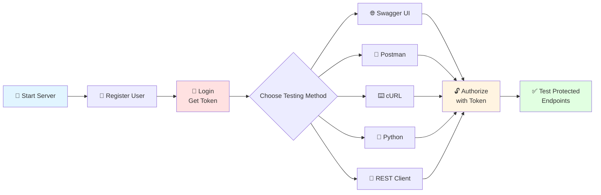

# API Testing Guide - Authentication and Protected Endpoints

Complete guide for testing authenticated endpoints in your Timecard Backend API.

---

## Testing Flow Overview



---

## Table of Contents
1. [FastAPI Swagger UI (Interactive Docs)](#1-fastapi-swagger-ui-interactive-docs)
2. [Postman](#2-postman)
3. [cURL (Command Line)](#3-curl-command-line)
4. [Python Requests](#4-python-requests)
5. [VS Code REST Client](#5-vs-code-rest-client)

---

## 1. FastAPI Swagger UI (Interactive Docs)

### Enabling Authentication in Swagger UI

Your auth is already configured with `OAuth2PasswordBearer`, so Swagger UI will have an **"Authorize"** button!

### Step-by-Step Testing:

#### Step 1: Start your server
```bash
source venv/bin/activate
uvicorn src.app.main:app --reload
```

Visit: **http://localhost:8000/api/v1/docs**

#### Step 2: Register a User (No Auth Required)

1. Find `POST /api/v1/auth/register` endpoint
2. Click **"Try it out"**
3. Enter request body:
```json
{
  "email": "test@example.com",
  "password": "testpass123",
  "full_name": "Test User"
}
```
4. Click **"Execute"**
5. You should get a `201` response with user data

#### Step 3: Login to Get Token

1. Find `POST /api/v1/auth/login` endpoint
2. Click **"Try it out"**
3. Enter credentials:
```json
{
  "email": "test@example.com",
  "password": "testpass123"
}
```
4. Click **"Execute"**
5. **Copy the `access_token`** from the response:
```json
{
  "access_token": "eyJhbGciOiJIUzI1NiIsInR5cCI6IkpXVCJ9...",
  "token_type": "bearer"
}
```

#### Step 4: Authorize in Swagger UI

1. Look for the **🔓 Authorize** button at the top right of the Swagger page
2. Click it
3. In the "Available authorizations" dialog:
   - Paste your token in the **Value** field
   - It should look like: `eyJhbGciOiJIUzI1NiIsInR5cCI6IkpXVCJ9...`
   - **Do NOT include "Bearer"** - Swagger adds it automatically
4. Click **"Authorize"**
5. Click **"Close"**

#### Step 5: Test Protected Endpoint

1. Find `GET /api/v1/auth/me` endpoint
2. Notice the 🔒 lock icon (means authentication required)
3. Click **"Try it out"**
4. Click **"Execute"**
5. You should get your user information:
```json
{
  "id": 1,
  "email": "test@example.com",
  "full_name": "Test User",
  "is_active": true,
  "created_at": "2026-04-02T15:30:00Z"
}
```

#### Step 6: Test Other Protected Endpoints

Now try creating a timecard:
1. Find `POST /api/v1/timecards/`
2. Click **"Try it out"**
3. Enter data:
```json
{
  "date": "2026-04-02T09:00:00Z",
  "hours_worked": 8.0,
  "description": "Testing API",
  "project": "Backend Development"
}
```
4. Click **"Execute"**
5. Should return `201` with created timecard

---

## 2. Postman

### Setup Collection in Postman

#### Step 1: Create New Collection
1. Open Postman
2. Click **"New"** → **"Collection"**
3. Name it: `Timecard API`

#### Step 2: Set Base URL Variable
1. Click on your collection
2. Go to **"Variables"** tab
3. Add variable:
   - Variable: `baseUrl`
   - Initial Value: `http://localhost:8000/api/v1`
   - Current Value: `http://localhost:8000/api/v1`
4. Save

#### Step 3: Add Requests

##### Request 1: Register User
- **Method:** `POST`
- **URL:** `{{baseUrl}}/auth/register`
- **Headers:**
  ```
  Content-Type: application/json
  ```
- **Body (raw JSON):**
  ```json
  {
    "email": "postman@example.com",
    "password": "postman123",
    "full_name": "Postman Test User"
  }
  ```
- **Save as:** `Register User`

##### Request 2: Login
- **Method:** `POST`
- **URL:** `{{baseUrl}}/auth/login`
- **Headers:**
  ```
  Content-Type: application/json
  ```
- **Body (raw JSON):**
  ```json
  {
    "email": "postman@example.com",
    "password": "postman123"
  }
  ```
- **Tests (to save token automatically):**
  ```javascript
  // Go to "Tests" tab and add this:
  if (pm.response.code === 200) {
      const response = pm.response.json();
      pm.collectionVariables.set("accessToken", response.access_token);
      console.log("Token saved:", response.access_token);
  }
  ```
- **Save as:** `Login`

##### Request 3: Get Current User (Protected)
- **Method:** `GET`
- **URL:** `{{baseUrl}}/auth/me`
- **Headers:**
  ```
  Authorization: Bearer {{accessToken}}
  ```
- **Save as:** `Get Current User`

##### Request 4: Create Timecard (Protected)
- **Method:** `POST`
- **URL:** `{{baseUrl}}/timecards/`
- **Headers:**
  ```
  Content-Type: application/json
  Authorization: Bearer {{accessToken}}
  ```
- **Body (raw JSON):**
  ```json
  {
    "date": "2026-04-02T09:00:00Z",
    "hours_worked": 8.0,
    "description": "Backend development work",
    "project": "Timecard System"
  }
  ```
- **Save as:** `Create Timecard`

##### Request 5: Get All Timecards (Protected)
- **Method:** `GET`
- **URL:** `{{baseUrl}}/timecards/`
- **Headers:**
  ```
  Authorization: Bearer {{accessToken}}
  ```
- **Save as:** `Get All Timecards`

### Testing Flow in Postman:

1. **Send "Register User"** → Should get 201 Created
2. **Send "Login"** → Should get 200 with token (automatically saved)
3. **Send "Get Current User"** → Should get your user info
4. **Send "Create Timecard"** → Should get 201 with timecard
5. **Send "Get All Timecards"** → Should get array of timecards

### Alternative: Collection-Level Auth

You can set authentication at the collection level:

1. Click on your `Timecard API` collection
2. Go to **"Authorization"** tab
3. Type: **Bearer Token**
4. Token: `{{accessToken}}`
5. Save

Now all requests inherit this auth (you can override per-request if needed).

---

## 3. cURL (Command Line)

### Complete Testing Workflow

#### Step 1: Register User
```bash
curl -X POST "http://localhost:8000/api/v1/auth/register" \
  -H "Content-Type: application/json" \
  -d '{
    "email": "curl@example.com",
    "password": "curl123",
    "full_name": "cURL Test User"
  }'
```

**Expected Response:**
```json
{
  "id": 1,
  "email": "curl@example.com",
  "full_name": "cURL Test User",
  "is_active": true,
  "created_at": "2026-04-02T15:45:00Z"
}
```

#### Step 2: Login and Save Token
```bash
# Login and extract token
TOKEN=$(curl -s -X POST "http://localhost:8000/api/v1/auth/login" \
  -H "Content-Type: application/json" \
  -d '{
    "email": "curl@example.com",
    "password": "curl123"
  }' | python -c "import sys, json; print(json.load(sys.stdin)['access_token'])")

echo "Token saved: $TOKEN"
```

Or manually:
```bash
curl -X POST "http://localhost:8000/api/v1/auth/login" \
  -H "Content-Type: application/json" \
  -d '{
    "email": "curl@example.com",
    "password": "curl123"
  }'
```

Copy the token from response and save it:
```bash
TOKEN="eyJhbGciOiJIUzI1NiIsInR5cCI6IkpXVCJ9..."
```

#### Step 3: Test Protected Endpoints

##### Get Current User
```bash
curl -X GET "http://localhost:8000/api/v1/auth/me" \
  -H "Authorization: Bearer $TOKEN"
```

**Expected Response:**
```json
{
  "id": 1,
  "email": "curl@example.com",
  "full_name": "cURL Test User",
  "is_active": true,
  "created_at": "2026-04-02T15:45:00Z"
}
```

##### Create Timecard
```bash
curl -X POST "http://localhost:8000/api/v1/timecards/" \
  -H "Authorization: Bearer $TOKEN" \
  -H "Content-Type: application/json" \
  -d '{
    "date": "2026-04-02T09:00:00Z",
    "hours_worked": 8.0,
    "description": "Testing with cURL",
    "project": "API Development"
  }'
```

##### Get All Timecards
```bash
curl -X GET "http://localhost:8000/api/v1/timecards/" \
  -H "Authorization: Bearer $TOKEN"
```

##### Get Specific Timecard
```bash
curl -X GET "http://localhost:8000/api/v1/timecards/1" \
  -H "Authorization: Bearer $TOKEN"
```

#### Pretty Print JSON Output

Using `jq` (install: `brew install jq`):
```bash
curl -s -X GET "http://localhost:8000/api/v1/timecards/" \
  -H "Authorization: Bearer $TOKEN" | jq
```

Using Python:
```bash
curl -s -X GET "http://localhost:8000/api/v1/timecards/" \
  -H "Authorization: Bearer $TOKEN" | python -m json.tool
```

#### Testing Error Cases

##### 401 Unauthorized (No Token)
```bash
curl -X GET "http://localhost:8000/api/v1/auth/me"
# Should return 401 error
```

##### 401 Unauthorized (Invalid Token)
```bash
curl -X GET "http://localhost:8000/api/v1/auth/me" \
  -H "Authorization: Bearer invalid_token_here"
# Should return 401 error
```

##### 401 Unauthorized (Expired Token)
```bash
# Wait 31 minutes (if token expiry is 30 min), then:
curl -X GET "http://localhost:8000/api/v1/auth/me" \
  -H "Authorization: Bearer $TOKEN"
# Should return 401 error
```

---

## 4. Python Requests

### Create Test Script: `test_api.py`

```python
import requests
import json
from datetime import datetime

# Base URL
BASE_URL = "http://localhost:8000/api/v1"

# Store token globally
TOKEN = None

def register_user(email, password, full_name):
    """Register a new user"""
    url = f"{BASE_URL}/auth/register"
    payload = {
        "email": email,
        "password": password,
        "full_name": full_name
    }
    
    response = requests.post(url, json=payload)
    print(f"Register Status: {response.status_code}")
    print(f"Response: {response.json()}\n")
    return response.json()

def login(email, password):
    """Login and get access token"""
    global TOKEN
    
    url = f"{BASE_URL}/auth/login"
    payload = {
        "email": email,
        "password": password
    }
    
    response = requests.post(url, json=payload)
    print(f"Login Status: {response.status_code}")
    
    if response.status_code == 200:
        data = response.json()
        TOKEN = data["access_token"]
        print(f"Token received: {TOKEN[:50]}...\n")
        return TOKEN
    else:
        print(f"Login failed: {response.json()}\n")
        return None

def get_current_user():
    """Get current authenticated user"""
    if not TOKEN:
        print("No token! Please login first.\n")
        return None
    
    url = f"{BASE_URL}/auth/me"
    headers = {
        "Authorization": f"Bearer {TOKEN}"
    }
    
    response = requests.get(url, headers=headers)
    print(f"Get Current User Status: {response.status_code}")
    print(f"Response: {json.dumps(response.json(), indent=2)}\n")
    return response.json()

def create_timecard(date, hours_worked, description, project):
    """Create a new timecard"""
    if not TOKEN:
        print("No token! Please login first.\n")
        return None
    
    url = f"{BASE_URL}/timecards/"
    headers = {
        "Authorization": f"Bearer {TOKEN}",
        "Content-Type": "application/json"
    }
    payload = {
        "date": date,
        "hours_worked": hours_worked,
        "description": description,
        "project": project
    }
    
    response = requests.post(url, json=payload, headers=headers)
    print(f"Create Timecard Status: {response.status_code}")
    print(f"Response: {json.dumps(response.json(), indent=2)}\n")
    return response.json()

def get_all_timecards():
    """Get all timecards for current user"""
    if not TOKEN:
        print("No token! Please login first.\n")
        return None
    
    url = f"{BASE_URL}/timecards/"
    headers = {
        "Authorization": f"Bearer {TOKEN}"
    }
    
    response = requests.get(url, headers=headers)
    print(f"Get All Timecards Status: {response.status_code}")
    print(f"Response: {json.dumps(response.json(), indent=2)}\n")
    return response.json()

def test_unauthorized_access():
    """Test accessing protected endpoint without token"""
    url = f"{BASE_URL}/auth/me"
    
    response = requests.get(url)
    print(f"Unauthorized Access Status: {response.status_code}")
    print(f"Response: {json.dumps(response.json(), indent=2)}\n")

if __name__ == "__main__":
    print("=" * 60)
    print("API TESTING WORKFLOW")
    print("=" * 60 + "\n")
    
    # Test 1: Register
    print("1. REGISTER USER")
    print("-" * 60)
    register_user("python@example.com", "python123", "Python Test User")
    
    # Test 2: Login
    print("2. LOGIN")
    print("-" * 60)
    login("python@example.com", "python123")
    
    # Test 3: Get Current User
    print("3. GET CURRENT USER (Authenticated)")
    print("-" * 60)
    get_current_user()
    
    # Test 4: Create Timecard
    print("4. CREATE TIMECARD (Authenticated)")
    print("-" * 60)
    create_timecard(
        date="2026-04-02T09:00:00Z",
        hours_worked=8.0,
        description="Testing with Python requests",
        project="API Testing"
    )
    
    # Test 5: Get All Timecards
    print("5. GET ALL TIMECARDS (Authenticated)")
    print("-" * 60)
    get_all_timecards()
    
    # Test 6: Unauthorized Access
    print("6. TEST UNAUTHORIZED ACCESS (Should Fail)")
    print("-" * 60)
    TOKEN = None  # Clear token
    test_unauthorized_access()
```

### Run the script:
```bash
python test_api.py
```

---

## 5. VS Code REST Client

### Install Extension
1. Open VS Code
2. Install extension: **"REST Client"** by Huachao Mao

### Create Test File: `api-tests.http`

```http
### Variables
@baseUrl = http://localhost:8000/api/v1
@email = vscode@example.com
@password = vscode123

### 1. Register User
POST {{baseUrl}}/auth/register
Content-Type: application/json

{
  "email": "{{email}}",
  "password": "{{password}}",
  "full_name": "VS Code Test User"
}

### 2. Login (Save token from response)
POST {{baseUrl}}/auth/login
Content-Type: application/json

{
  "email": "{{email}}",
  "password": "{{password}}"
}

### 3. Set token (Copy from login response and paste below)
@token = eyJhbGciOiJIUzI1NiIsInR5cCI6IkpXVCJ9...

### 4. Get Current User (Protected)
GET {{baseUrl}}/auth/me
Authorization: Bearer {{token}}

### 5. Create Timecard (Protected)
POST {{baseUrl}}/timecards/
Content-Type: application/json
Authorization: Bearer {{token}}

{
  "date": "2026-04-02T09:00:00Z",
  "hours_worked": 8.0,
  "description": "Testing with VS Code REST Client",
  "project": "API Development"
}

### 6. Get All Timecards (Protected)
GET {{baseUrl}}/timecards/
Authorization: Bearer {{token}}

### 7. Get Specific Timecard (Protected)
GET {{baseUrl}}/timecards/1
Authorization: Bearer {{token}}

### 8. Update Timecard (Protected)
PUT {{baseUrl}}/timecards/1
Content-Type: application/json
Authorization: Bearer {{token}}

{
  "hours_worked": 9.0,
  "description": "Updated description"
}

### 9. Delete Timecard (Protected)
DELETE {{baseUrl}}/timecards/1
Authorization: Bearer {{token}}

### 10. Test Unauthorized (Should fail)
GET {{baseUrl}}/auth/me
# No Authorization header - should return 401
```

### Usage:
1. Click **"Send Request"** above any `###` section
2. View response in new panel
3. Copy token from login response to `@token` variable

---

## Quick Reference Table

| Method | Tool | Auth Setup |
|--------|------|------------|
| **Swagger UI** | Built-in | Click 🔓 Authorize button, paste token |
| **Postman** | Desktop App | Add `Authorization: Bearer {{token}}` header |
| **cURL** | Terminal | `curl -H "Authorization: Bearer $TOKEN"` |
| **Python** | Script | `headers = {"Authorization": f"Bearer {TOKEN}"}` |
| **REST Client** | VS Code | `Authorization: Bearer {{token}}` in .http file |

---

## Common Issues & Solutions

### Issue 1: "Not authenticated" error
**Solution:** Make sure you're including the `Authorization` header:
```
Authorization: Bearer your_token_here
```

### Issue 2: Token expired
**Solution:** Login again to get a new token. Tokens expire after 30 minutes (default).

### Issue 3: Swagger UI not showing Authorize button
**Solution:** Your code already uses `OAuth2PasswordBearer`, so it should appear. If not:
1. Check that endpoints use `Depends(get_current_user)`
2. Restart server
3. Hard refresh browser (Cmd+Shift+R)

### Issue 4: 401 Unauthorized even with valid token
**Solution:** 
1. Check token format: `Bearer <token>` (note the space)
2. Verify token hasn't expired
3. Check `SECRET_KEY` in `.env` matches what was used to create token

### Issue 5: CORS errors in browser
**Solution:** Already configured in your `main.py`, but ensure frontend origin is in `CORS_ORIGINS`

---

## Testing Checklist

- [ ] Register new user → Get 201 Created
- [ ] Login with correct credentials → Get token
- [ ] Login with wrong credentials → Get 401
- [ ] Access `/auth/me` without token → Get 401
- [ ] Access `/auth/me` with valid token → Get user info
- [ ] Create timecard with valid token → Get 201
- [ ] Get all timecards with valid token → Get array
- [ ] Access protected endpoint with expired token → Get 401
- [ ] Update own timecard → Success
- [ ] Delete own timecard → Success

---

## Next Steps

1. **Start simple:** Use Swagger UI first (easiest)
2. **Use Postman:** For saving requests and sharing with team
3. **Use cURL:** For quick terminal testing and scripts
4. **Use Python:** For automated testing and CI/CD

For automated testing, check `tests/` directory - these run the same flows programmatically!
